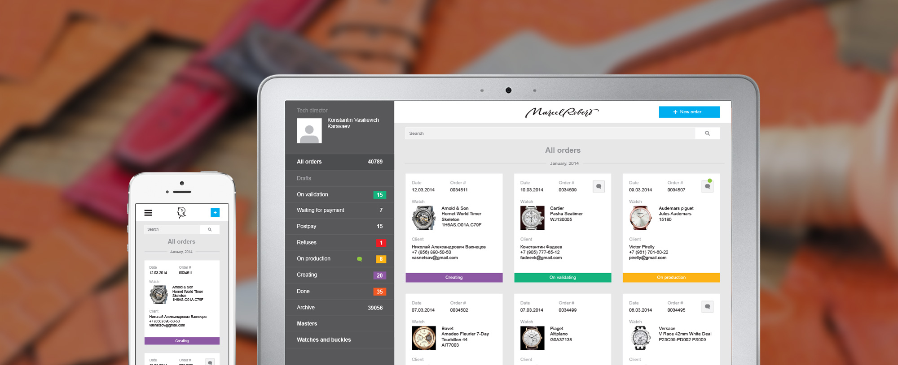
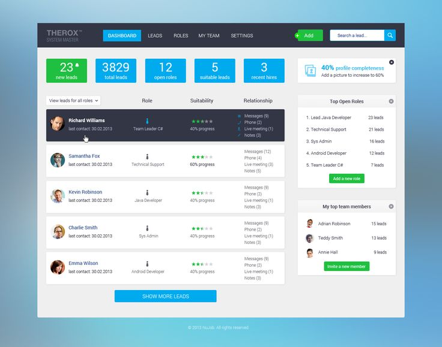
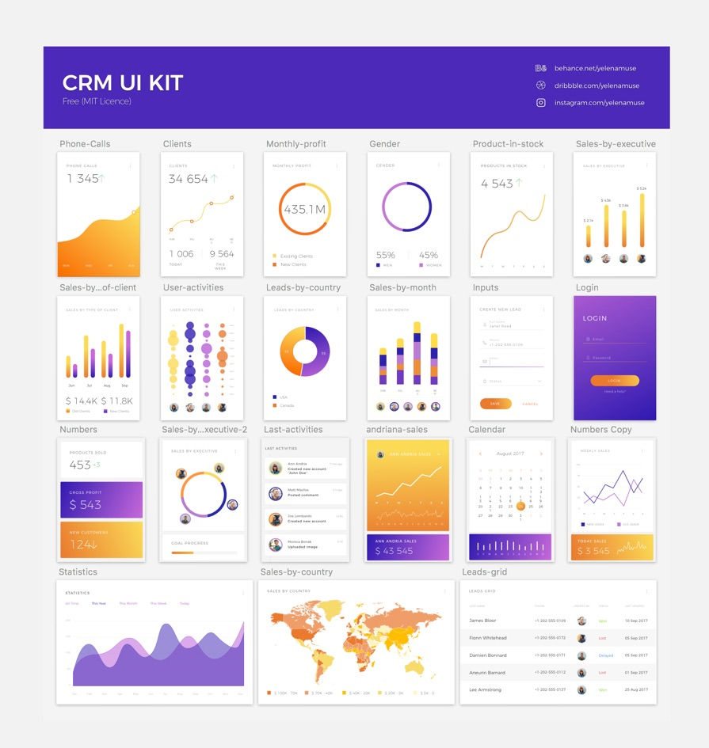

## CRM et ERP
 

_
"CRM is not just another website developpement !"
_

 

	« Entreprise Ressource Planning »
	« Customer Relationship Management »

# Un petit regard sur l'éxistant

1/ L'open source
-------------
	# Odoo
		les (-) Il faut payer pour toutes applications en plus
		les (+) Joli et très riche
		
		https://www.odoo.com/fr_FR/

	# Crême
		les (-) Design très "old-school"
		les (+) Est gratuit

		https://demos.cremecrm.com/creme_login/?next=/

	# Dolibarr
		les (-) Beaucoup beaucoup de features
		les (+) Beaucoup beaucoup de features

		https://demo.dolibarr.org/compta/index.php?mainmenu=billing&leftmenu=

	# Yeti
		les (-) Peut-être trop de feature
		les (+) Gratuit, complet

		https://gitdeveloper.yetiforce.com/index.php

L'open source dans le CRM offre de nombreuses possibilité, il en existe certainement plus d'une centaine dans le monde.

Predictive analytics en recense 41, et a fait un top : 

>_https://www.predictiveanalyticstoday.com/top-free-open-source-crm-software/_

2/ Les CRM sur le marché
-------------

<h5>Capterra propose un classement des CRM online</h5> 

_Agile crm, vcita, capsule, teamgate..._

<h5>Business news daily fait une sélection de 5 acteurs seulement :</h5> 

	# Less Annoying
		-> "Best Low-Cost"
		$10 per user, per month

	# Sugar CRM
		-> "Best for devlopper"
		40$ per user 

	# Hubspot 
		-> "Very small business" 
		50$ per user 

	# Salesforce 
		-> "Small business"
		25$ per user 

	# Zoho 
		-> "Best overall"
		12$ per user 

3/ En images
-------------

	Quels sont les articles qui se vendent le plus, et a quel profil de client ?

images/02.jpg

	All in one.
	Dashboard outil éducatif, donc sujet très different, 
	mais on voit très bien comment sont réparties les informations importantes.

	Disposition plus classique, problèmatique tout autre, mais clareté des informations.

images/04.jpg

	Plus épuré, couleurs plus haut de gamme. 
	(Si la tablette doit être tournée vers le client, utilité d'un design en adéquation avec la marque,	l'idée étant de donner l'impression de privilège et non pas d'une simple entrée dans une bdd).
	 

images/05.png

	Pas pour nous, mais c'est joli.

	CRM pour mobile, simple /!\ ici PSD uniquement.

images/07.png

	Orienté data !

images/08.jpg

	Epuré et limpide.

images/09.jpg

	Moins simple mais tout aussi clair.

# Les outils à connaitre

4/ JS tools for data 
-------------
**Canvas.js** 
 
*Sans doute, le plus simple. Clair et beau.* 
		
	Exemple de nouvelle possibilité :
	https://canvasjs.com/javascript-charts/drilldown-chart/
	"Click on any segment to Drilldown"

*Drag and drop, could be an idea, here are some usefull tools*
 

	https://vuejsexamples.com/a-vuejs-grid-with-draggable-and-resizable-boxes/
	https://alligator.io/vuejs/drag-and-drop-vue-draggable/
	https://alligator.io/

*Plus complexe est certainement trop lourd à prendre en mains :*

	https://dzone.com/articles/4-useful-javascript-libraries-for-data-analysis-an

	Data-Driven-Documents :
	Js data, CDN, level : hard I guess
	Aperture JS :
	Js data + map, level :  easy
	InfoVis :
	InfoVis is an UBER techno
	Cytoscape :
	https://cytoscape.github.io/cytoscape.js-tutorial-demo/
	Level : hard I guess

*Un peu old-school :*
 

	Datatables.js

5/ Dans la presse
-------------
**La plus forte croissance en 2018**

>_https://www.solutions-numeriques.com/crm-la-plus-forte-croissance-en-2018-sur-le-marche-des-logiciels/_

**Odoo est le logiciel de gestion le plus installé dans le monde**
>_https://www.solutions-numeriques.com/dossiers/odoo-est-le-logiciel-de-gestion-le-plus-installe-dans-le-monde/_

06/ Inspiration possible
--------------

>https://themeforest.net/tags/crm

>https://markbutler.myportfolio.com/crm-ui-kit

>http://preview.themeforest.net/item/flatkit-app-ui-kit/full_screen_preview/13231484?_ga=2.86070620.597376920.1535359639-1288420163.1529479010

07/ Ouverture
-------------

	Quels sont les features qu'il reste à imaginer ?

08/ Sources
-------------

>_https://www.businessnewsdaily.com/7839-best-crm-software.html_  
-02

>_https://www.capterra.com/online-crm-software/_  
-02

